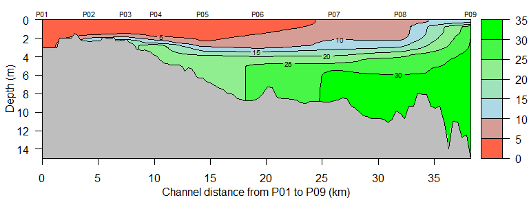
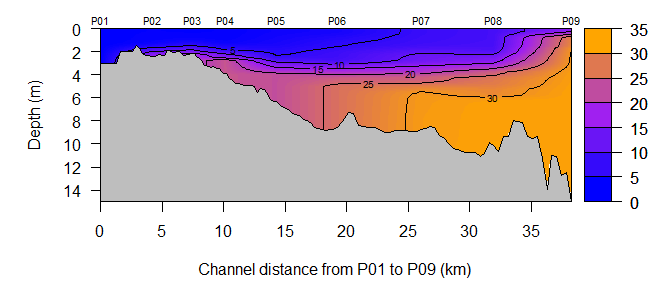

## CTDplot

#### *Marcus W. Beck, mbafs2012@gmail.com*

[](https://travis-ci.org/fawda123/CTDplot)

Create two-dimensional contour plots of CTD water quality data.  Currently only works with example data for Pensacola Bay, Florida. Install the package as follows:


```r
install.packages('devtools')
library(devtools)
install_github('fawda123/CTDplot')
library(CTDplot)
```


```r
# default plot
ctd_plot(ctd_ex1, 'Salinity')
```

 

```r
# make color ramp match contour categories in legend
ctd_plot(ctd_ex1, 'Salinity', ncol = 8)
```

 

```r
# change colors
ctd_plot(ctd_ex1, 'Salinity', cols = c('Blue', 'Purple', 'Orange'))
```

 

```r
# plot two dates with same color scaling
dat <- list(ctd_ex1, ctd_ex2)
ctd_plotmult(dat, 'Salinity', var_labs = c('April', 'May'))
```

 
