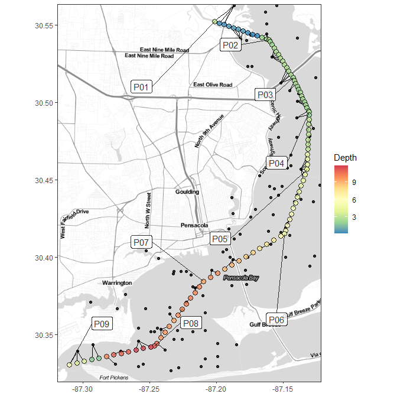

## CTDplot

#### *Marcus W. Beck, <mbeck@tbep.org>*

[](https://github.com/fawda123/CTDplot/actions)
[](https://zenodo.org/badge/latestdoi/41971249)

Create two-dimensional contour plots of CTD water quality data. Install
the package as follows:

``` r
install.packages('devtools')
library(devtools)
install_github('fawda123/CTDplot')
library(CTDplot)
```

Minimal data requirements to use the functions are CTD observations at
stations on a longitudinal axis. Bathymetric depth soundings at points
along the sampling axis can also be used to improve the plot. The
plotting function first creates new points along the sampling axis for
interpolating CTD observations throughout space. The new sampling axis
is matched to the nearest depth sounding or actual bottom depth at the
closest CTD sampling station. If depth soundings are not provided, the
bottom depth at each CTD station is used to interpolate a continuous
depth along the sampling axis. The following shows matching of a
sampling axis to depth soundings. The depth soundings are sub-sampled
for illustration. The new sampling axis is colored by matched depth and
the hydrological soundings are shown as black points.

``` r
nr <- 1:nrow(PB_dep_pts)
dep_smp <- PB_dep_pts[sample(nr, 200, replace = F), ]
dt <- as.Date('2014-04-21')
toplo <- ctd[ctd$Date %in% dt, ]
get_depths(toplo, dep_smp, expand = 100, plot = T)
```

<!-- -->

The main function is `ctd_plot`, which can be used with or without
bathymetric data.

``` r
dt <- as.Date('2014-04-21')
ctd_plot(dat_in = ctd, var_plo = 'Salinity', date = dt)
```

<!-- -->

``` r
#  with bathymetric data
ctd_plot(dat_in = ctd, var_plo = 'Salinity', dep_in = PB_dep_pts, date = dt)
```

<!-- -->

Plots across dates can also be scaled for comparison.

``` r
# plot two dates with same color scaling
dat <- split(ctd, ctd$Date)
labs <- names(dat)
ctd_plotmult(dat, 'Salinity', PB_dep_pts, var_labs = labs, txt_scl = 1.5)
```

<!-- -->

Bottom values across dates and stations can be compared with
`ctd_bplot`.

``` r
ctd_bplot(ctd, var_plo = 'DO')
```

<!-- -->

``` r
ctd_bplot(ctd, var_plo = 'Salinity')
```

<!-- -->
